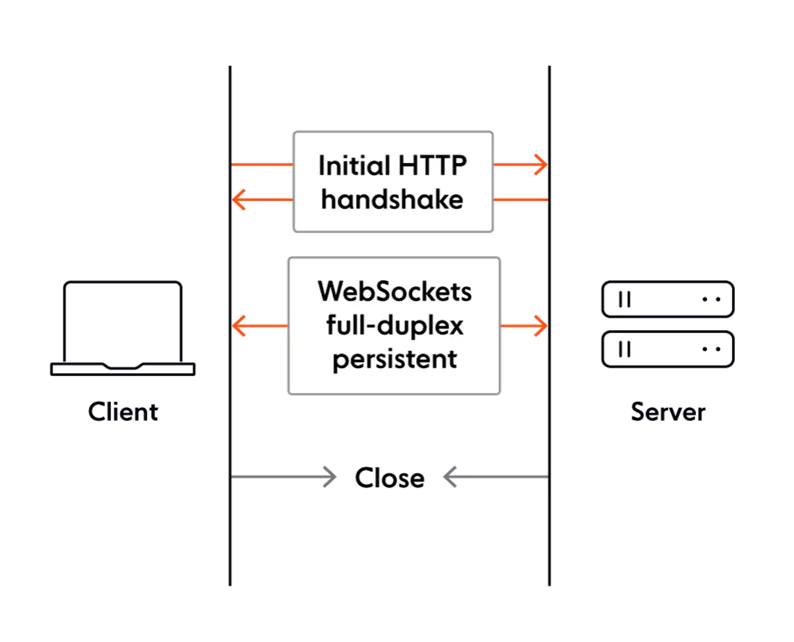
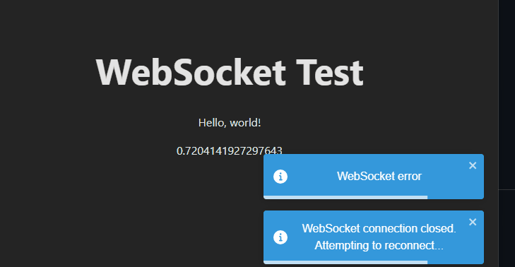

# Websocket Event Stream Demo

## Overview

How to send unprompted messages from a Rust service to a webbrowser (React) client? Websockets is a good option.  This is an experiment to try out how difficult it is to set up a websocket communication using [tokio-tungstenite](https://github.com/snapview/tokio-tungstenite) and [ws](https://www.npmjs.com/package/ws).

Requires [Rust](https://www.rust-lang.org/), [Nodejs](https://nodejs.org/en) and [Yarn](https://yarnpkg.com/getting-started/install).

```bash
cargo run && yarn && yarn dev
```

## What Are Websockets?

[source](https://ably.com/blog/introducing-the-websocket-handbook)

We can broadly group WebSocket use cases into two distinct categories:

- Realtime updates, where the communication is unidirectional, and the server streams low-latency (and often frequent) updates to the client. Think of live sports updates, alerts, realtime dashboards, or location tracking, to name just a few use cases.

- Bidirectional communication, where both the client and the server send and receive messages. Examples include chat, virtual events, and virtual classrooms (the last two usually involve features like polls, quizzes, and Q&As). WebSockets can also be used to underpin multi-user synchronized collaboration functionality, such as multiple people editing the same document simultaneously.



---

## Demo



```jsx
ws.current.onmessage = (event: MessageEvent<string>) => {
        // Logs any message received from server
        const data = JSON.parse(event.data) as WebSocketMessage<unknown>;
        console.log('Message from server: ', event.data);
        if (data.topic === "random") {
          console.log('Message includes: ', data.payload);
          setPayload(data.payload as Random);
        }
    };
```

```rust
async fn handle_connection(peer: SocketAddr, stream: TcpStream) -> Result<()> {
    let ws_stream = accept_async(stream).await.expect("Failed to accept");
    info!("New WebSocket connection: {}", peer);
    let (mut ws_sender, mut ws_receiver) = ws_stream.split();
    let mut interval = tokio::time::interval(Duration::from_millis(1000));
    
    // Echo incoming WebSocket messages and send a message periodically every second.
    loop {
        tokio::select! {
            msg = ws_receiver.next() => {
                match msg {
                    Some(msg) => {
                        let msg = msg?;
                        if msg.is_text() ||msg.is_binary() {
                            ws_sender.send(msg).await?;
                        } else if msg.is_close() {
                            break;
                        }
                    }
                    None => break,
                }
            }
            _ = interval.tick() => {
                let websocket_message = WebSocketMessage {
                    topic: "random".to_string(),
                    payload: Payload {
                        num: random(),
                        message: "Hello, world!".to_string(),
                    },
                };
                ws_sender.send(
                    Message::Text(
                        serde_json::to_string(&websocket_message).unwrap()
                        )
                    ).await?;
            }
        }
    }
    Ok(())
}
```
